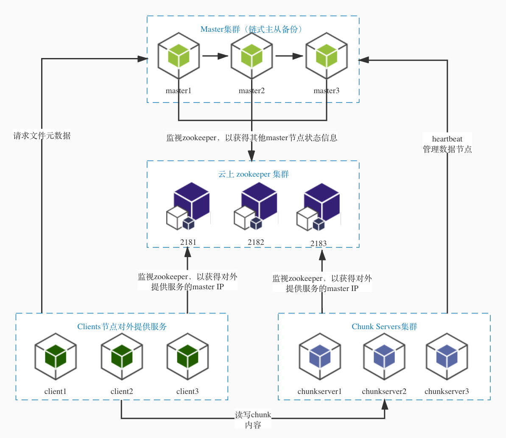

# awesomeGFS

### 关于文档

- 设计文档：awesomeGFS为go实现的GFS，其架构图如下，具体设计思路可见[设计文档](https://github.com/SJTU-SE347/gdocs-heroines-and-me/blob/main/code/awesomeGFS/doc/DesignDoc/DFS-Design-Doc.md)。
- 测试文档：awesomeGFS一共设有21个单元/集成测试，在[测试文档](https://github.com/SJTU-SE347/gdocs-heroines-and-me/blob/main/code/awesomeGFS/doc/TestDoc/DFS-Test-Doc.md)中详细列出，具体代码可参考*awesome_test.go*。



### 使用指南

##### 一、工具

强烈建议安装Goland，小尚和小张都爱用

##### 二、依赖安装与DEBUG  

首先打开 GO MODULE 包管理方式：  
- 下列命令行操作针对 macOS 
```
export GO111MODULE=on
export GOPROXY=https://goproxy.cn
go env 查看以上变量设置是否正确
```
- 下列命令行操作针对 Windows
```
C:\> $env:GO111MODULE = "on"
C:\> $env:GOPROXY = "https://goproxy.cn"
```

接着下载依赖：（凭本事消除import中的红线）
```
go mod tidy      检测依赖
go mod download  下载依赖
go mod vendor    导入依赖
```

##### 三、编译与启动

1. 请参考[Goland入门指南（使用Goland创建并运行项目）](http://c.biancheng.net/view/6170.html) 
2. 请在配置时设置output directory，生成可执行文件在项目根目录下。
3. 按照 main.go 中的说明来运行，参数 client 会跑HTTP版的 client 在 localhost:1314 端口。

##### 四、端到端测试

postman的测试脚本请参考：[Document](https://documenter.getpostman.com/view/12000033/Tzm5Gwda)
