## DFS测试文档

#### 测试用例

我们为***awesomeGFS***（即我们项目的DFS）设计了一共***21***个测试用例，覆盖了对Master、ChunkServer、Client等对象的单元测试以及一致性、容错测试等。所有测试都在*awesomeGFS/awesome_test.go*文件中。具体每个测试用例的含义如下：

- **基础文件操作测试（共9个测试）**

  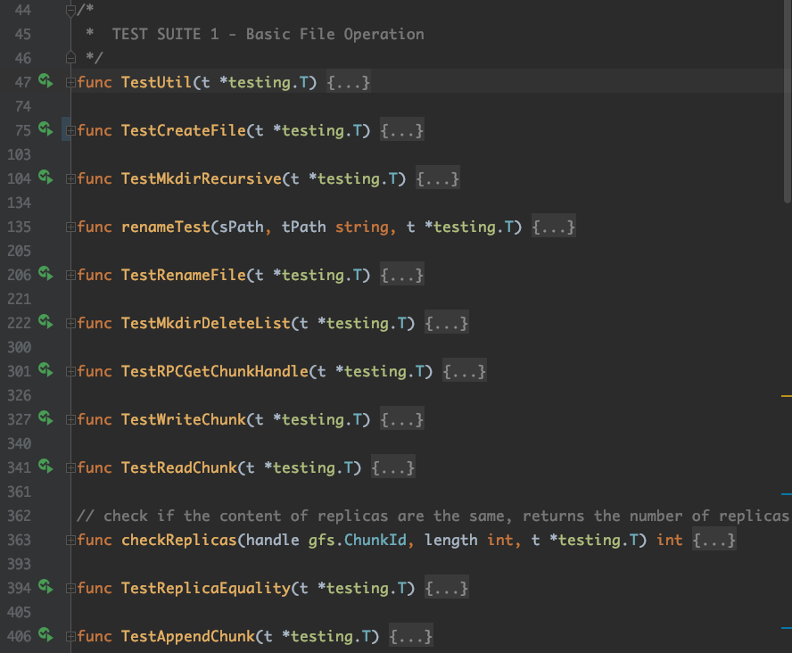

  - **TestUtil**：测试了util.go文件中的一些util函数，包括SplitFilePath、FindCommonPath等对路径进行处理的util函数。
  - **TestCreateFile**：主要对Master的Create API进行测试，测试了其正确性以及对错误参数的处理，包括重复创建同名文件，在不存在的路径下创建文件，以及在文件下创建文件三种错误文件创建场景。
  - **TestMkdirRecursive**：测试了Master的Mkdir API，即递归创建文件夹的接口的正确性，检查其是否能递归的创建新文件夹。
  - **TestRenameFile**：测试了Master的Rename API的多种场景。
    - 测试场景：包括source和target在同一个文件夹下、source和target在父子文件夹下、source和target在不同路径（在不同文件夹下且两者的目录无父子关系）下等等。
    - 测试用例设计初衷：Master的Rename API是Master的namespace_manager下最复杂的一个API，因为namespace_manager对于namespace的并发写问题采用的方案是细粒度锁，也就是为每个dir都加一把读写锁，而不是使用一把大锁锁住整个namespace。因此Rename的实现中包括了对source路径和target路径的共同路径解析，对于source和target共同路径下的dir只需要拿一把读锁，因此不能直接对source和target路径调用lockParents和unlockParents（否则会重复拿锁），而拆解剩余的source和target的非共同路径部分可以再使用lockParents和unlockParents来进行锁处理。此外需要注意，不同于其他路径上的目录，source文件和target文件的根目录需要拿写锁，这也增加了Rename函数的复杂性。
  - **TestMkdirDeleteList** ：对Master的Mkdir、Create、List和Delete API进行综合性测试。首先调用Mkdir在根目录下创建文件夹（并测试重复创建），而后调用Create在根目录以及新创建的文件夹下创建若干文件（并测试重复创建文件），调用List列出几个文件夹下的文件，检查List是否能覆盖所有子文件，最后调用Delete删除文件夹下文件后再次调用List检查删除是否有效。
  - **TestRPCGetChunkHandle**：主要测试Master的GetChunkHandle API。首先调用Create在根目录下创建新文件，并使用新文件的路径调用Master的GetChunkHandle接口两次，检查两次结果是否相同。最后对错误参数处理进行测试，调用GetChunkHandle接口时传入参数Index为2（即找到该文件的第三个Chunk，由于该文件刚被创建，不应该有第三个Chunk），检查是否能够返回错误。
  - **TestWriteChunk**：对Client的WriteChunk API进行正确性测试。
  - **TestReadChunk**：对Client的ReadChunk API进行正确性测试。
  - **TestReplicaEquality**：对Chunkserver上保存的Chunk做一致性检查，检查对同一块Chunk做的Replication是否相同。

- **Client API测试（共7个测试）**

  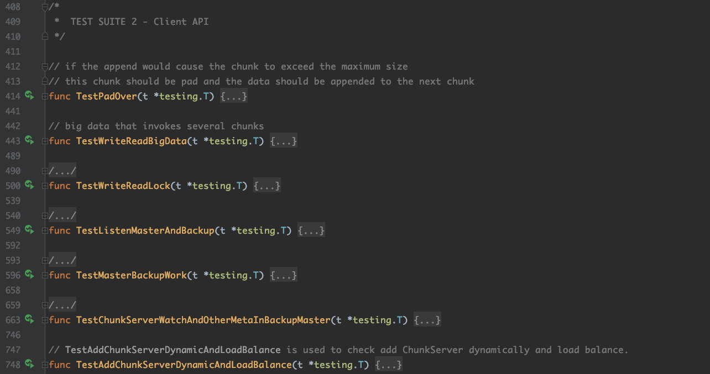

  - **TestPadOver**：对Client的Append API进行了一个特殊场景测试。即当Append的内容会溢出文件原有的最后一个Chunk时，应当将溢出部分的内容写入新的Chunk当中，新Chunk将取代原有Chunk成为新的最后一个Chunk。该用例的测试方法为，首先新建文件，对其进行4次常规的Append写入（即写入同一个Chunk，写入直到该Chunk只剩下最后4个byte），而后进行第五次Append写入，即特殊场景写入（写入5个byte，溢出原有的最后一个Chunk），检查返回值是否正常。
  - **TestWriteReadBigData**：用较大的数据对Client的Read、Write API进行测试。具体测试方法为，首先创建新文件，构造大小为3个Chunk size的buffer并调用Write API写入文件；然后调用Read API读取3个Chunk size大小的文件数据（从offset=0开始），并比对是否与之前写入的数据一致；最后进行特殊场景的测试，尝试调用Read API读取三个Chunk size大小的文件数据（offset为文件中央，也就是1.5个Chunk size的位置），并检查是否有报错，因为此时文件已经读到结尾应该返回EOF。
  - **TestWriteReadLock**：
  - **TestListenMasterAndBackup**：
  - **TestMasterBackupWork**：
  - **TestChunkServerWatchAndOtherMetaInBackupMaster**：
  - **TestAddChunkServerDynamicAndLoadBalance**：

- **容错测试（共5个测试）**

  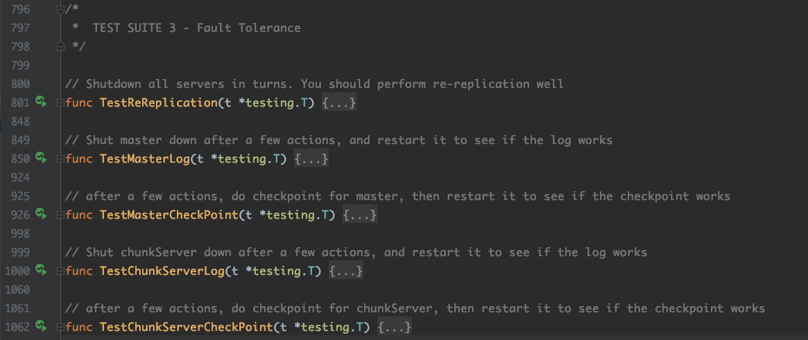

  - **TestReReplication**：测试系统在若干chunkserver崩溃后是否能保持对某个chunk的Replication。
    - 测试方法：创建一个新chunk后，使用Shutdown()让若干台chunkserver宕机（该函数的作用为屏蔽对该chunkserver的所有RPC请求，使得该chunkserver对外界RPC不做任何反应，从外界看来该chunkserver可以视作死亡）再逐个恢复，等到所有chunkserver恢复后再等候一段时间，最后向master发送请求查询该chunk对应的chunkserver，若数量高于一定值则视为保持了Replication，测试通过。
    - 对于这种容错场景，awesomeGFS系统的应对措施为：一方面，通过心跳机制检查chunkserver是否存活，若检查到有chunkserver死亡，则将其储存的chunk信息进行更新（chunk到chunkserver的mapping要去掉这个死掉的chunkserver）；另一方面，如果有chunk的replica数量过低，则添加至master管理的replicasNeedList中，每隔一段时间会对这个list中的chunk做ReReplication，以保证每个chunk的Replication数量足够。
  - **TestMasterLog**：测试单点Master在宕机后是否能从Log当中恢复出之前的数据，也就是Log的正确性。由于CheckPoint也已经在Master代码中实现，测试的时候需要保证在Master尚未做CheckPoint时就进行崩溃处理。具体测试过程为，首先清空log文件，启动一个Master并制造一些数据（通过Mkdir和Create），检查Master在崩溃前确实写入了这些数据（通过List），而后在Master做CheckPoint之前对Master进行崩溃处理（调用Shutdown()函数），检查Master在崩溃后恢复了这些数据（通过List），由于此时没有Checkpoint，因此如果Master在崩溃后恢复了数据就可以证明Master Log的正确性，最后将该Master关闭，并清空log文件。
  - **TestMasterCheckPoint**：测试单点Master在宕机后是否能从CheckPoint当中恢复出之前的数据，也就是CheckPoint的正确性。由于Log也已经在Master代码中实现，测试的时候需要保证剔除Log的影响。具体测试过程为，首先清空log文件，启动一个Master并制造一些数据（通过Mkdir和Create），检查Master在崩溃前确实写入了这些数据（通过List），而后强制Master做CheckPoint（若不做强制CheckPoint则数据都在Log当中）并立刻对Master进行崩溃处理（调用Shutdown()函数），检查Master在崩溃后恢复了这些数据（通过List），由于此时没有Log的影响，因此如果Master在崩溃后恢复了数据就可以证明Master CheckPoint的正确性，最后将该Master关闭，并清空log文件。
  - **TestChunkServerLog**：测试单点ChunkServer在宕机后是否能从Log当中恢复出之前的数据，也就是Log的正确性。具体测试过程和TestMasterLog类似。
  - **TestChunkServerCheckPoint**：测试单点ChunkServer在宕机后是否能从CheckPoint当中恢复出之前的数据，也就是CheckPoint的正确性。具体测试过程和TestChunkServerLog类似。

#### 测试结果

*注意：每次测试前需要清空gfs/log路径下的所有log文件*

- 前13个测试可以一次性连续通过，结果如下图所示：

  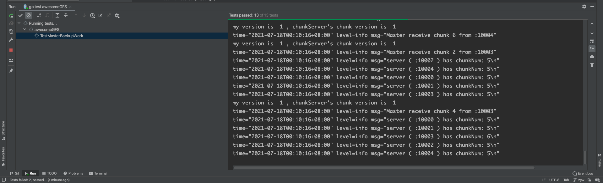

- 由于测试用例之间存在间接影响，后8个测试用例需要单独跑，测试结果按次序如下图所示：

  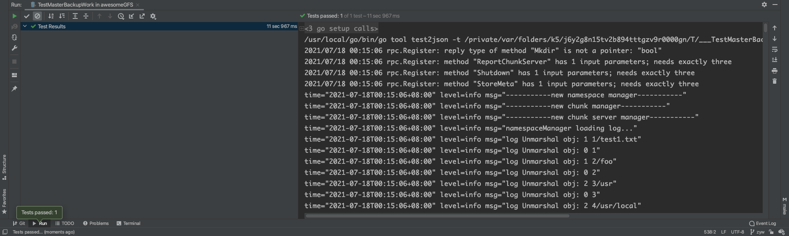

  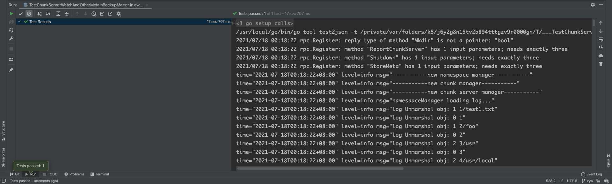

  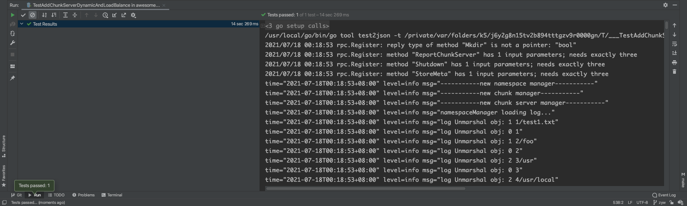

  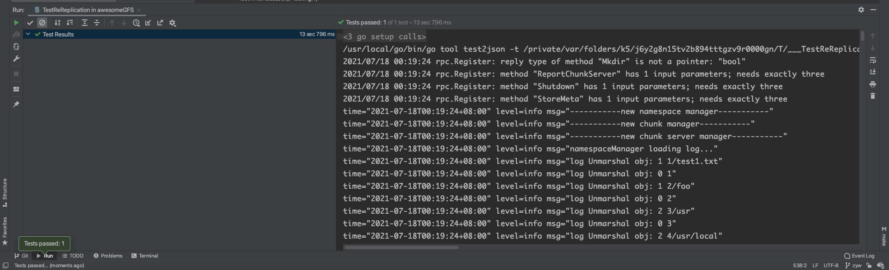

  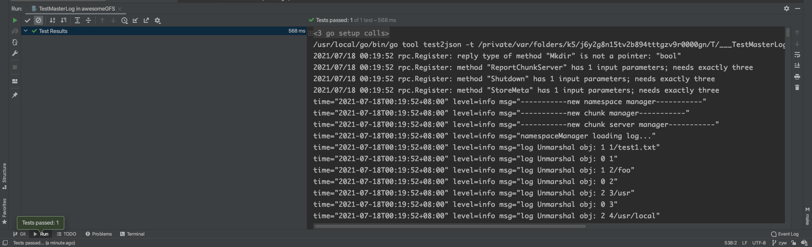

  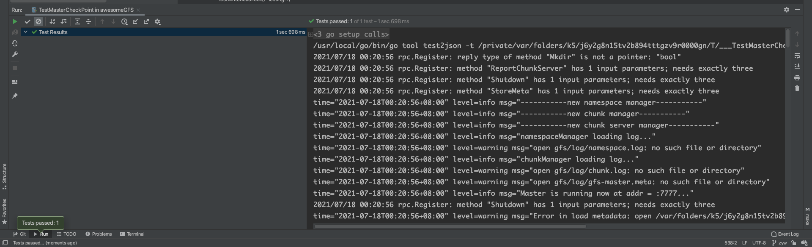

  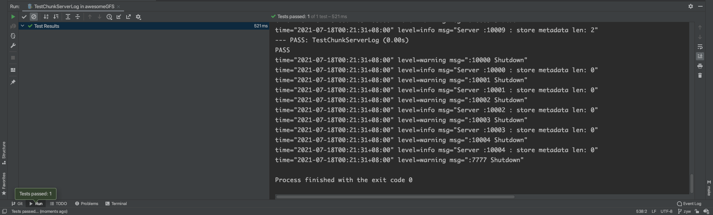

  

 最终测试结果为21个测试全部通过。