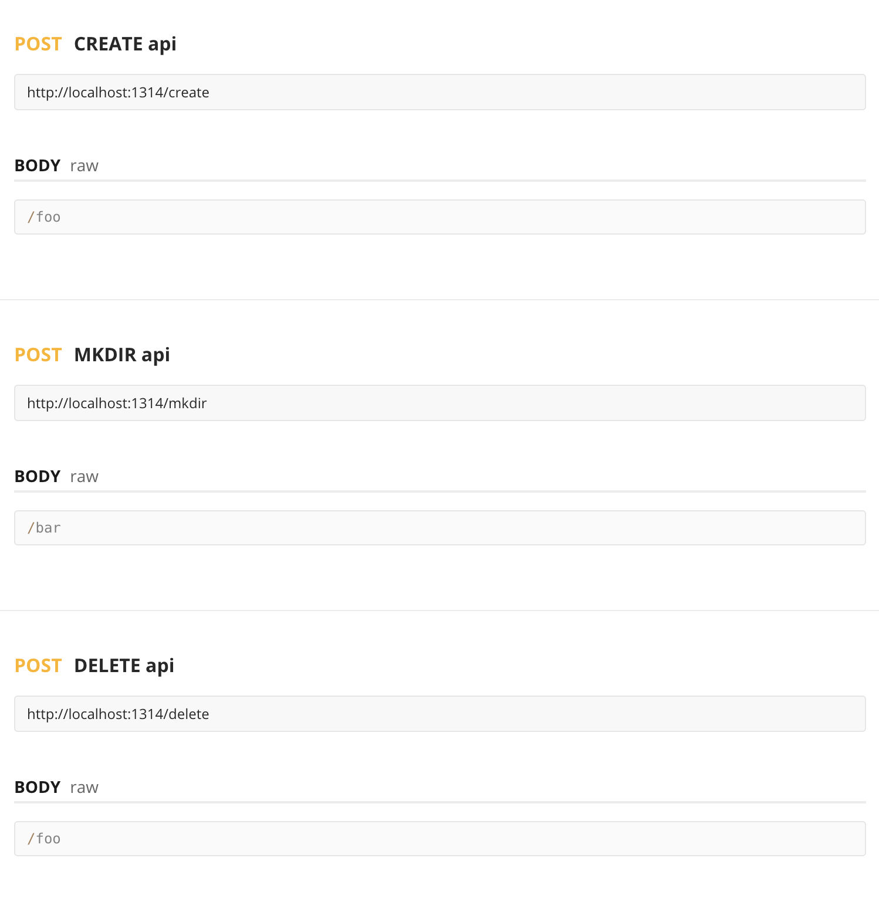

## DFS设计说明

DFS是本次云计算项目的重要组成部分，为应用程序的后端提供文件系统的支持。DFS的功能需求包括文件系统接口，非功能需求包括全分布式架构、一致性、容错和故障恢复等。我们利用课堂所学，经过在设计实现过程中与其他同学的反复讨论，最终得到了高可用、高可靠的DFS —— 我们称之为 ***awesomeGFS ！***

本设计说明共分五个部分：

- **架构与实现** 部分阐述总体架构及DFS是怎样工作的；
- **分布式问题阐述** 部分主要介绍为什么要Zookeeper，Zookeeper在我们的系统中起到什么作用等；
- **功能点突出设计** 部分围绕容错和性能介绍特殊需求的巧妙实现；
- **基本功能与进阶功能实现** 部分介绍项目需求的功能点是如何达成的；
- **接口阐述** 部分详细说明了系统对上层应用提供的HTTP接口。


### 一、架构与实现

架构与实现部分讲解总体架构和我们DFS的实现

#### 1）总体架构


从整体上来看，***awesomeGFS*** 主要由Master，ChunkServer，Client节点以及Zookeeper集群构成。Master主要负责维护文件系统元数据，ChunkServer负责文件系统中文件数据的存储，Client负责对上层应用提供文件系统接口，zookeeper负责协调系统中的各个成员。每种角色的具体功能介绍如下：

- Master：Master集群的结构为链式主从备份结构，该结构在提供高可靠备份的同时尽可能提高资源利用率，详情见 ***功能点突出设计*** 部分。 Master节点主要负责保存文件系统的元数据，包括文件系统的Namespace结构、File到Chunk的mapping以及Chunk到存储chunk的ChunkServer节点的mapping。Master节点不负责文件数据的保存，但负责对ChunkServer以及ChunkServer上存储的Chunk的管理：对于每一个新创建的Chunk，由Master选出若干ChunkServer来存储该Chunk数据，并确定它们的Primary-Backup关系。同时，Master通过心跳机制与ChunkServer建立联系，动态维护Chunk到ChunkServer之间的mapping。
- ChunkServer：ChunkServer主要负责以Chunk形式保存文件系统中的文件数据，会定期向Master发送HeartBeat，并接受Master 管理（比如，哪些Chunk由该ChunkServer维护，包括创建新的Chunk或对原先Chunk的舍弃和回收，同时这些Chunk的最新版本号由Master指定）。此外，对于维护一个Chunk的一组ChunkServer，它们之间的关系为主从备份关系，Primary由Master指定，且通过租约机制维护。当Master发现租约过期时，就会指定一个新Primary和新版本号，并将这个信息发送给所有维护该Chunk的ChunkServer。
- Client：Client的作用是对上层应用提供文件系统服务。由于我们项目的GFS由Go语言编写，后端项目由Java编写，我们将GFS的Client写作HTTP Server形式，也就是说，Java后端通过发送HTTP请求给Client来调用文件系统的接口。举例来说，当Java后端需要读一份文件时，向Client发送Read请求，Client会先向Master发送请求获取文件元数据以及保存相关Chunk的ChunkServer信息，然后直接向ChunkServer发送请求获取Chunk数据。
- ZooKeeper：Zookeeper集群作为一个高可靠的健壮单点负责整个系统中的协调工作。协调工作包括：1. 决定分布式Master中哪个节点是提供服务的，而其他节点只作为元数据备份。告诉Client和ChunkServer正在提供服务的节点，告诉Master节点其在链式主从备份中的位置。2. 决定当前可用的Client节点位置，告诉后端。3. 多个Client读写同一文件时要用以Zookeeper实现的读写锁进行并发控制。注意，Zookeeper不保存文件系统的任何数据或元数据，只起协调作用。


#### 2）代码结构

如前所述，我们认为 ***awesomeGFS*** 采用了GFS的标准实现，Master、ChunkServer、Client各司其职。下面简要介绍我们的代码结构，包括代码规范，函数排列规则，以方便您快速理解和阅读我们的代码。

由于篇幅限制，为了避免文档复杂而冗长，我们以文件为单位进行介绍，对函数作用的追问请看函数前的注释。

```
// awesomeGFS
- gfs：							GFS主要的源代码
  - master：						Master节点的主要代码
   	- chunk_manager.go：			维护File到ChunkId，以及ChunkId到ChunkServer的mapping
   	- chunkserver_manager.go：	通过heartbeat与ChunkServer进行通信，同时对其进行管理
   	- master.go：				Master节点初始化，后台活动，以及RPC接口
   	- namespace_manager.go：		维护文件系统namespace结构
  - chunkserver：				ChunkServer节点的主要代码
   	- chunkserver.go：			ChunkServer节点初始化，后台活动（垃圾回收），以及RPC接口
   	- download_buffer.go：		在内存中暂存写入数据，完成2PC准备阶段，过期清理完成2PC回退过程
  - client：						Client节点的主要代码
   	- client.go：				Client节点初始化，提供文件系统接口，注册HTTP服务
   	- leasebuffer.go：			Client写入Chunk时的元数据租约，到期清理
  - util：						工具类、工具函数以及全局类等
   	- array_set.go：				带读写锁的数组工具类
   	- log.go：					定义与日志有关的类和常量
   	- util.go：					RPC工具函数
   	- zookeeper.go：				Zookeeper常量和工具函数，包括连接、监听、读写锁等
  - log：						用于存放Master节点和ChunkServer节点日志和CheckPoint的位置
   	- chunk.log：				Master节点中chunk_manager的log
   	- namespace.log：			Master节点中chunk_manager的log
   	- chunkserver.log：			ChunkServer节点的log
   	- gfs-master.meta：			Master节点的CheckPoint
   	- gfs-chunkserver.meta：		ChunkServer节点的CheckPoint
- main.go：						启动函数，更加详细的项目编译使用指南见awesomeGFS/README
```

（注：log文件夹不属于项目代码内容，可在命令行启动时设置为任意目录。）

我们的代码排列有序，每个函数前均包含对该函数作用以及调用和被调用关系的解释。对于复杂的文件如`master.go` `chunkserver.go` `client.go ` 等长度超过700行的代码，代码内容依次包括：服务初始化函数，注册操作Zookeeper函数，后台活动函数，RPC/HTTP接口和实现函数，以及为了测试而设计的辅助函数。

代码使用Goland进行开发，最大程度上减少了黄线警告，单词拼写、结构体初始化规范等问题。


### 二、分布式问题阐述

分布式问题阐述部分讲解我们对分布式问题的理解和对 Zookeeper 的使用，下方是Zookeeper目录图


#### 1）健壮的协调者

##### 问题阐述：

分布式系统需要一个统一决策的大脑，这个大脑中包含了服务和调度的逻辑，也包含系统运行的实时状态。在MapReduce系统中唯一的决策者是Master，在GFS中也同样是Master。

但单点故障或网络异常是不可避免的，对于Master来说也需要容错机制来提高突发情况下的可用性和可靠性。这时我们最容易想到的方式便是主从备份，当“主Master”崩溃时，“从Master”立即取代原有“主Master”的位置提供服务，进行决策。这样便提高了分布式系统对于Master崩溃的容错能力。

但多个Master节点到底谁作为“主Master”提供服务呢？Client什么时候可以向“从Master”请求服务呢？当“从Master”联系不到“主Master”的时候是否就可以独立服务了呢？这些问题的本质实际上是分布式场景下网络划分时带来的脑裂问题。想要不脑裂，可以引入一个单点的决策者，我们称之为“协调者”，由它来确定上述问题的答案。但是，单点故障的问题又一次产生了。

怎样跳出单点故障和脑裂的死循环呢？CAP理论救了我们。我们知道了：分布式系统中要有一个能够容忍网络划分、又保证一致性的集群，它像一个健壮的单点一样提供协调的服务。要给GFS引入这样的集群，一个现成的实现就是大名鼎鼎的 —— Zookeeper。

##### 运用 Zookeeper 解决问题：

我们使用Zookeeper实现了对Master节点IP地址的维护，这包括对Master、ChunkServer、Client代码逻辑的改进。总体上，我们实现了多个Master的主从备份，并可动态添加Master节点，提高了对Master单点故障的容错能力。

实现上，Master节点在服务启动时会先在Zookeeper中注册自己的IP地址，具体做法是创建“临时的”“序号递增的”的文件在  `/master` 目录下（假设Zookeeper生成的文件名为 `master0000000167`），文件内容是自己的服务所在的 `IP:Port` 。之后它得到`/master`目录下的所有文件，若发现有序号比自己小的文件则作为该Master的备份，此后开始监听`/master`目录的变化，保证目录下文件序号小于 167 的最大序号文件所代表的Master是自己的“主Master”，文件序号大于 167 的最小序号文件所代表的Master是自己的备份。

Client 和 ChunkServer 通过在启动时得到`/master`目录下序号最小的文件内容，接着监听该节点的“节点删除事件”，来时刻更新自己请求服务的目标对象，即“主Master”。


#### 2）灵活的分布式服务部署

##### 问题阐述：

GFS分布式文件系统对外提供服务的Client节点有多个，一方面可以避免Client单点故障导致的拒绝服务，但更重要的其实是对外部访问请求进行分流，缓解单点压力，提高系统可拓展性。

于是，怎样灵活配置Client，提高分流的性能和效果，成为我们分布式文件系统需要精进的问题。

##### 运用 Zookeeper 解决问题：

正如上文注册Master节点IP地址，我们的Client在启动时也注册了IP地址，直到崩溃才会消失。Java后端在启动时先向Zookeeper询问所有可用的Client服务地址，并选出离自己最近，网络RTT最小的Client进行后续的请求。同时，监听已连接的Client节点，一旦节点崩溃，重新挑选可用的Client。


#### 2）多Client下的并发控制

##### 问题阐述：

GFS分布式文件系统中有多个Client同时提供服务，由于文件读写操作只是利用了Master中关于Chunk的元数据，真正的读写还是由Client所主导的，因此不同的Client同时读写显然会造成冲突，即读到的内容包含只写了一部分的中间状态或两次写操作后的最终状态与任意全局顺序的结果都不同，等等。

因此Client的读写应该进行并发控制。为了提高并行性，同时保证公平性，我们希望采取没有偏向的读写锁来实现。

##### 运用 Zookeeper 解决问题：

Zookeeper同样可以作为分布式锁来使用。首先举例一个互斥锁的实现：只需在读或写某个文件时在Zookeeper的 `/client` 目录下创建一个同名临时文件即可，在读写结束时关闭会话，删除临时文件。由于Zookeeper不支持同名文件重复创建，因此同一时间只有一个Client能够成功创建该文件，进入临界区，而其余Client由于无法创建文件被阻挡在临界区外。

当然，我们不希望使用简答的互斥锁，于是就要有一套自己读写锁的逻辑设计了。请看上面的Zookeeper目录图，现在共有四个对于文件 `/user1/File1`的读写请求，他们创建Zookeeper文件的顺序是：读（1）读（2）写（1）读（3）。接下来将以这些读者写者来讲解读写锁的实现。

读者请求读锁的逻辑是：在Zookeeper的`/file`目录下创建`\user1\File1`文件（如果该文件已存在则不创建），接着在`/file/\user1\File1`目录下接着创建“临时的”“序号递增的” `READ` 文件（比如得到成功创建的文件名为 `READ0000000005` ），接下来读者检查有没有序号小于自己的 `WRITE `文件，如果没有就拿到读锁，否则如果有就监听那个 `WRITE` 文件直到其被删除，此时便拿到读锁。如图上的“读（3）”，它将等到“写（1）”结束才会拿到锁，才能继续读文件的操作；而图上的“读（2）”，虽然前面有正在进行的“读（1）”，但仍可以拿到读锁进行读文件操作。

写者请求写者的逻辑与读者相似，区别是它监听序号小于自己的最大序号的 `READ` 文件，当此 `READ` 文件删除时，需要重新确认自己前面还有无 `READ` 文件，如果有则重新开始监听，否则拿到写锁。如图上的“写（1）”，在它创建 `WRITE` 时前面有两个 `READ` ，它开始监听“读（2）”，之后“读（2）”结束了，它又发现“读（1）”没有结束，又继续监听“读（1）”，直到“读（1）”结束，它才进入临界区开始写操作。

如上所述，我们利用Zookeeper实现了没有偏向的分布式读写锁。测试请见测试文档。


### 三、功能点突出设计

功能点突出设计部分介绍我们为提高容错和性能所做的突出工作

#### 1）多 Master 链式主从备份

容错是文件系统一直关注的问题，对于分布式文件系统也是如此。文件系统的故障按照影响内容不同可分为元数据的破坏和数据的腐败或丢失，显然，元数据一致性是更加重要的问题，它不仅涉及文件内容，还会产生安全或系统崩溃的问题。

GFS分布式文件系统的元数据全部在Master中（如果不算ChunkServer存储的Chunk版本号的话，因为版本号错误的最坏影响是数据丢失，而与底层管理中的映射关系无关），因此对Master的备份就显得格外重要。

我们提出 Master 链式主从备份的方法，主要特性有：***高性能、高主机利用率、原子的提交与撤销***


我们的链式主从备份的运行方式是：当主Master收到RPC请求时，若有备份节点，则对该备份节点调用相同的RPC请求，若无备份节点则做修改元数据的工作然后返回。如图所示，Master1首先调用Master2的RPC方法，Master2再调用Master3的RPC方法，当收到Master3的成功返回时，Master2开启另一个线程继续做自己修改元数据的操作，同时立即返回成功，Master1也立即返回成功给Client。

**正确性：**链式主从备份的关键在于主从备份的Commit Point，我们将备份节点的成功完成作为Commit Point。这样设计的原因是倘若在修改元数据过程中Master2崩溃，则Master1也能将“已完成”的信息正确返回给Client，同时Master3马上成为Master1的备份节点，两者间不会出现不一致。即使Master1也崩溃，只要它将“已完成”的信息成功返回给Client，则Client也能在接下来的运行中连接存活的Master3，使系统正常运行。如果Master3在修改元数据的过程中宕机，则此次RPC请求失败，系统中不会存在不正确的状态。

**高性能：**在我们的主从备份过程中，以三个Master形成的链为例，整个RPC调用过程所用时间为：修改元数据操作的时间 + 3次网络RRT（Round-Trip Time），相比不做备份只多了两次网络往返延迟。

**高主机利用率：**当链上的任意主机崩溃时，都不会影响其他主机的正常使用，正常的其他主机继续形成链式主从备份。而当崩溃的主节点恢复时，会加入到链式主从备份中成为链的尾部，在动态加入时，新的节点会读取它的“主Master”的CheckPoint文件和Log文件，从而同步到最新的元数据状态上。

**原子的提交与撤销：**提交点是原子的（若不考虑Master2在发送成功消息返回给Master1前崩溃），若未达到提交点则存活的其余节点状态没变，而崩溃节点在恢复时会同步到最新的元数据状态上，因此可以正确撤销。


#### 2）2PC + 版本号机制下的一致性

对于GFS来说，数据节点崩溃的错误也是必须要考虑的。在我们的分布式文件系统中，每个Ckunk共在3个ChunkServer上进行备份，定时选举出3个ChunkServer中的Primary和Secondary，实现写入过程的2PC，保证多备份间的一致性，该Primary和Secondary的选举用租约机制进行维护，适时进行重新选举。

我们假设在写入过程中多节点同时崩溃不会发生，因此主要考虑单点故障的情况。


**协调者角色选择：**经过认真讨论和分析，我们还是将Chunk的主数据节点作为2PC的Coordinator，而不是Client，因为Clinet是暂时的，在理想的实现中，Client实际是作为上层应用后端中的文件系统库存在的，我们不应该将Coordinator放在一个系统外的节点上，因为任何其上产生的日志等信息都是不可请求读取的，并且崩溃恢复后的地址也是易变的。

**传统2PC实现的挑战与问题：**在我们用Primary做Coordinator的2PC实现中，Primary的崩溃对数据一致性的打击是巨大的，因为这属于协调者和参与者的同时崩溃，2PC是无法解决这种问题的。另外，传统的2PC方法在某单点崩溃时会阻塞直到该节点恢复，而在GFS中，为了高可用性，我们不能让请求阻塞，而需要立即得到结果。

**实现逻辑：**最终我们的2PC逻辑如图所示：首先会用节点间流式的方式依次传输数据到ChunkServer的内存缓存中（如论文中所述），这样的目的在于减轻Primary的网络压力，同时保证了整个过程的性能。在Primary收到所有Secondary都缓存成功后，Primary开始持久化数据，同时多线程发送请求令Secondary进行提交，当Primary完成数据持久化并收到所有Secondary的成功返回时，才向Client返回成功（CommitPoint）。

**容错：**显然，我们实现的上述逻辑并不支持回滚，同样的我们也不能通过日志的方式前移提交点，支持回滚，这是因为：当Primary在返回Client成功但还未持久化以及通知Secondary提交的时候崩溃，即使Primary记录了该写入已经成功的日志，但Primary存在不可预期的重启时间，Secondary不可能等到Primary重启、同步后再开始服务。实际上，该问题在CAP理论中也能证明，在分布式场景下，无法同时做到C（一致性）和A（可用性）。

相比客户端认为已成功写入的数据实际未被写入造成永远的数据丢失，客户端认为未能成功写入而实际写入了的代价小的多，因为客户端往往在写入失败后重新写入直到成功为止。在版本号的支持下，我们保证用户不会读到错误陈旧的数据。

**版本号的正确性保证以及可用性分析：**既然明确知道会出现一致性的问题，那么问题的关键在于如何让Client避免读到陈旧的数据。我们的租约机制和版本号很好的保证了这点。


我们系统的设置为：心跳间隔200ms，检查server是否死亡的间隔400ms，判断server死亡的条件为从上次心跳到检查的时长超过1s，主从选举租约到期的时间为3s。

上图所示是一种最坏情况，假设某个Chunk对应的一个ChunkServer在 t 时刻被Master选举为Primary（或Secondary），紧接着在t 时刻发送自己的心跳告诉Master自己还活着，再接着在 t 时刻宕机。那么接下来的 1.4s 内，对Chunk的写请求会失败直到 1.4s 后，Master通过检查Server已不再存活，使选举租约失效。1.4s后的新写入会触发重新选举，并使每个还活着的Server对该Chunk的版本号加 1。于是，当Server重启后，Master会发现其版本号已陈旧，于是告知其放弃对该节点的维护。

因此我们通过版本号顺利解决了读到脏数据的问题，在不一致的情况下记录正确的数据。


#### 3）动态添加节点与负载均衡

***动态添加节点*** 实际上不难实现，由于在ChunkServer启动时会询问Zookeeper正在提供服务的Master，因此任意时刻启动的ChunkServer都可以向Master发送心跳信息。

当Master收到来自陌生ChunkServer的心跳时，立即将该ChunkServer添加到自己的管理中，同时通过`RPCReportSelp`让该ChunkServer汇报自己存储的Chunk信息，若版本号与最新版本号一致，则保留，若版本号陈旧，则在回复中让该ChunkServer放弃维护Chunk，则此Chunk会在接下来的垃圾回收中被ChunkServer删除。

所以，动态添加节点的功能实际上是ChunkServer故障恢复中必须做的，我们也做到了。


***负载均衡*** 的实现则需要动点脑筋，需要设计一套逻辑使数据迁移尽可能少。

实际上没有那么复杂，对于文件系统来说，Master本就是先知。我们根本不需要像一致性哈希表那样进行设计，因为Chunk存放在哪里不是哈希规则确定的，而是Master直接确定的。因此我们的算法借用实现补充replica的RPC调用即可生效。

如上图，3个ChunkServer共存放了4个不同的Chunk，由于每个Chunk都要3备份，因此在每个ChunkServer中均维护了4个Chunk，共计12个。当新的ChunkServer加入时，它向Master汇报完毕，自己一个Chunk也没有，于是Master计算新情况下的平均Chunk数：12 / 4 = 3，每个ChunkServer最多维护3个Chunk，于是Master依次统计Chunk数多于3个的ChunkServer，并将他们的任意Chunk发请求拷贝到没有此Chunk且Chunk数不足3的server上，直到该ChunkServer的Chunk数等于3。


### 四、基本需求与进阶需求实现

基本需求与进阶需求实现部分介绍我们对于立项文档中的需求的完成情况

#### 1）Basic Requirements 基本需求实现

- ***Operation:***  awesomeGFS对上层应用提供create、mkdir、delete、rename、list、read、write、append等基本文件系统接口。
- ***Chunk**:* 与GFS相同，awesomeGFS将文件切分为多个大小固定的Chunk，并为每个Chunk指定多个ChunkServer来保存数据。Master节点负责创建和维护File到Chunk的映射，Client在读写文件数据时拿着从Master节点拿到的ChunkServer信息直接与ChunkServer进行通信。
- ***Replication**:* 对于每一个Chunk，Master都会为其分配多个ChunkServer来保存其数据，并指定其中一个为Primary其余为其Backup，每当有数据写操作时Primary需要确保所有Backup都执行完写操作后才能返回成功（并Commit该操作）。同时，Master会为每个Chunk维护一个最新的版本号，当Client向Master请求某个Chunk的Primary-Backup信息/Lease信息时，Master会检查该Chunk对应的Primary ChunkServer持有的Lease是否有效，若无效则向新Primary分配Lease，并对这组ChunkServer都做版本号的检查（如果ChunkServer上维护的该Chunk的Version号过低，则进行丢弃）。当存有某个Chunk的ChunkServer数过低，该Chunk会被记入Master的一个List中，每隔一段时间（异步）为这些Chunk分配新的ChunkServer来保证Replication的数量。
- ***Fault Tolerance:*** 容错部分我们实现了对Master崩溃的容错和对ChunkServer崩溃的容错，均能容忍最多`N - 1` 个节点的崩溃，在上文中有讨论，同时在视频中也会展示。
- ***Consistency:*** awesomeGFS中的每一个Chunk都有一组ChunkServer来保存其数据，这组ChunkServer的结构为Primary-Backup结构。也就是说，保存某个Chunk的一组ChunkServer中有一个是Primary。当一个写操作来的时候，Client会首先向该组ChunkServer中的任意一个调用RPCForwardData（可见chunk server.go文件），该操作通过ChunkServer之间的RPC通信链式地将该写操作的内容传遍这组ChunkServer；该操作返回成功后Client会向Primary调用RPCWriteChunk，正式将这个写操作Apply，Primary也会向所有secondary发送RPCApplyMutation请求，只有所有secondary都成功apply了这个写操作，该操作才被视为完成了（Commit Point）。
- ***Concurrency Control:*** 我们实现了基于Zookeeper的文件粒度的读写锁，在***分布式问题阐述***部分已做说明。
- ***Failure Recovery:*** awesomeGFS中的Master和ChunkServer都会使用日志来进行故障恢复。
  - Master节点中主要维护了三种数据：namespace结构、File到ChunkId的mapping和ChunkId到ChunkServer的mapping。第三种mapping并不会被持久化，而是一直放在内存中，当Master崩溃重启后，可以从ChunkServer处重新获得该数据。而前两个数据结构，namespace树，以及File到Chunk的map，都需要做Log操作。以namespace为例，在执行一个Create操作时需要将该操作的序列号、类型、时间以及各种参数都写到日志中，执行完后再Log一条带相同序列号的Commit类型的日志（Commit日志的格式与前者相同，序列号也相同，只是类型为COMMIT，具体设置可见log.go）。故障恢复时会按顺序一条条读取日志，碰到Commit类型的日志就把对应序列号的操作重做一遍。
  - ChunkServer需要写入内存的数据与Master节点中的chunk_manager类似，主要是节点ID到节点的版本号、长度的mapping，日志格式与故障恢复过程与Master相似。
  - 具体的日志格式大致如下图所展示：
    


#### 2）Advanced Requirements 进阶要求实现

- ***Scalability:*** 见Load Balance

- ***Load Balance:*** 动态添加节点和负载均衡已在上文中进行说明，同时在视频中也做了展示，这里不再说明。

- ***Checkpoint:***  awesomeGFS中的Master和ChunkServer都使用了Checkpoint机制。这些节点都设置了一个定时任务叫做*storemeta*，做的就是checkpoint任务。以Master中的namespace_manager为例，当定时任务出发时会依次做以下操作：

  1. 获取日志锁，防止与日志写并发
  2. 将维护的数据结构序列化（namespace树转化为数组），使用工具encode后写入meta文件
  3. 清空日志文件（因为之前的数据都已经被checkpoint持久化了）
  4. 放掉日志锁，允许日志继续写入

  通过引入CheckPoint机制，大大减小了日志的长度，也简短了故障恢复的过程（因为之前的日志更长，且通过日志恢复需要重做操作，比较慢）。加入CheckPoint后的故障恢复分为两步：

  1. 读取meta文件中的数据，使用工具decode后反序列化恢复出原来的数据结构
  2. 读取日志文件，在CheckPoint得到的数据基础上对Commit了的操作进行redo

  


### 五、接口阐述

接口阐述部分讲解系统为上层应用提供的HTTP接口：




